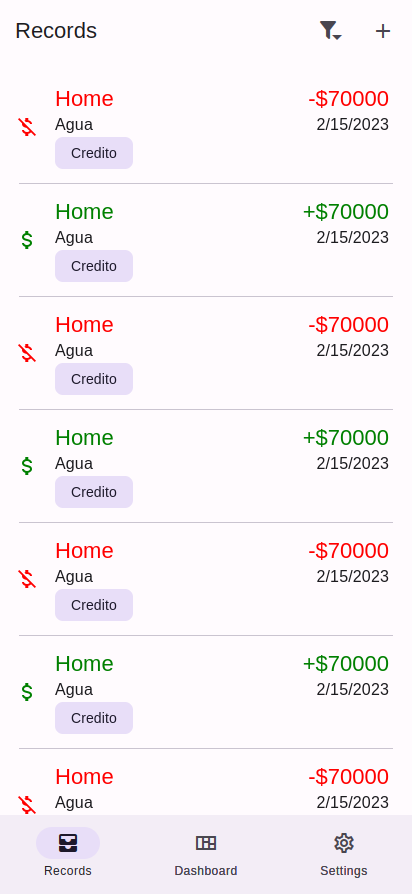
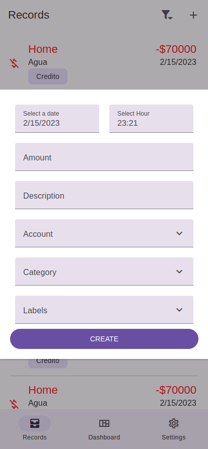
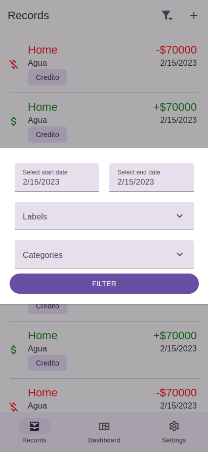

<h1>A simple expenses app</h1>

<h3>This is not a functional version, sorry pal, I'm still working on it</h3>

```
  yarn [script]

  "scripts": {
    "start": "expo start",
    "tunnel": "expo start --tunnel",
    "android": "expo start --android",
    "ios": "expo start --ios",
    "web": "expo start --web"
  }

```





